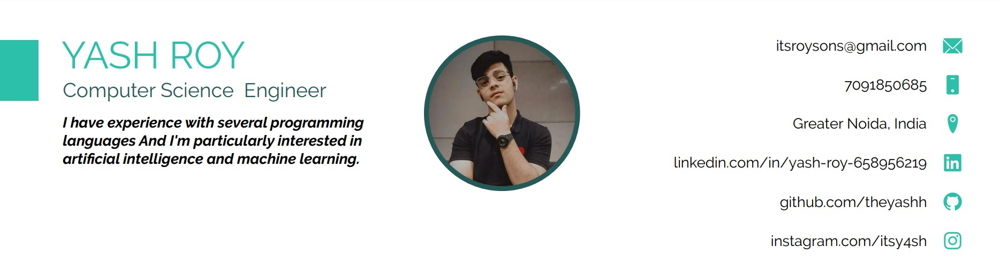
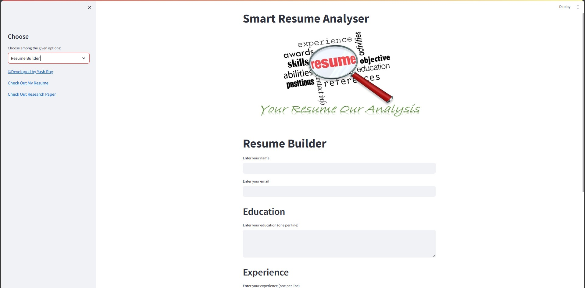
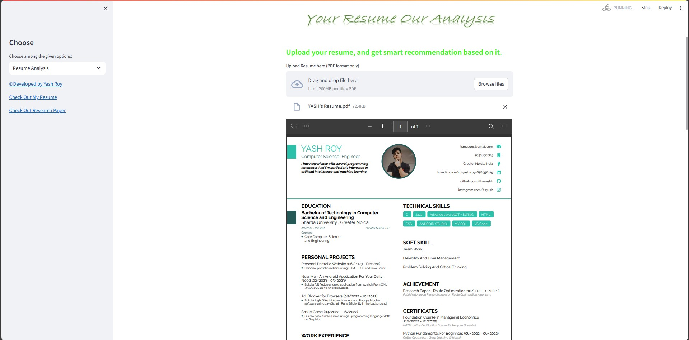
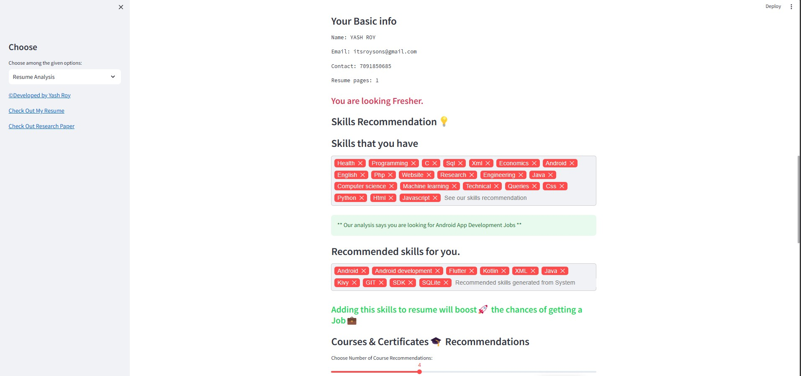
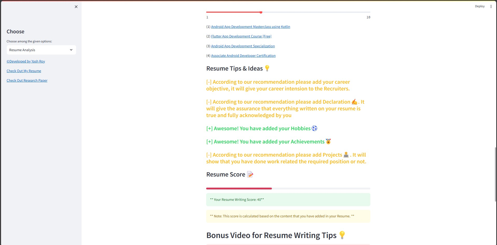
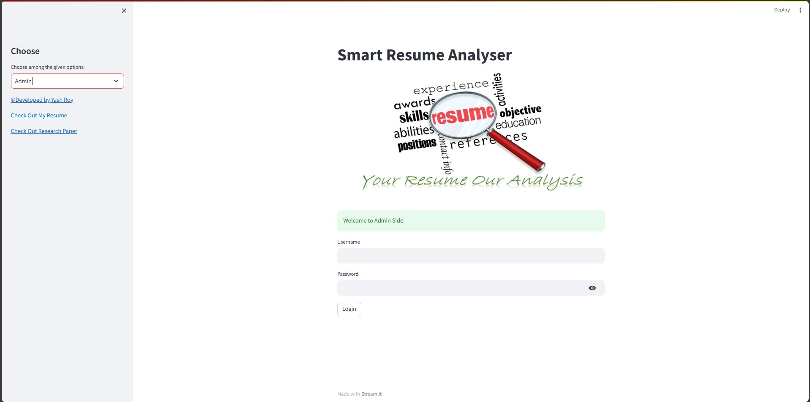

# Smart Resume Analyser 

                 
   
## [Developed By Yash Roy](https://www.linkedin.com/in/yash-roy-658956219/)
<a href="https://www.linkedin.com/in/yash-roy-658956219/">

## [Check out my Resume](https://drive.google.com/file/d/1pWM04M3vW422_sYA3zNbkDhgOP5hlRwM/view?usp=sharing)
<a href="https://drive.google.com/file/d/1pWM04M3vW422_sYA3zNbkDhgOP5hlRwM/view?usp=sharing">

## [Features]()

- Resume Builder, Resume analysis & Admin Section
- Resume Template
- Resume Score
- Career Recommendations
- Resume writing Tips suggestions
- Courses Recommendations
- Skills Recommendations
- Youtube video recommendations

## Working of Application

- User Will select from sidebar for operation
- After selecting resume builder 
  - user will have to input relative data and generate resume
  - After resume is generated , user will be able to download resume in pdf format
- After the resume analysis section is chosen
  - The user will upload their resume on our website 
  - The iframe used will display the User uploaded resume
  - Our website will analyse the resume and display some basic information about the user
  - Then it will display the level of the resume that was built by user basically it is analysing the number of pages and the contents that are included in the resume section
  - After that it will display the skills that That user Already have also based on those skills the resume will also display related skills that users can build to improve their resume in their respective fields
  - Then the website will display the class recommended to the user based on their skills
  - After ever fields are displayed then the website will recommend courses related to the skills that were recommended to user to further enhance their skill for better job
  - User can get the recommendation Between 1 to 4 courses based on their preferences, A sliding bar can be used to change the preferences of total  course recommendation
  - After that there will be a section of resume tips and ideas where user will be given positive points for the section that are included in resume and negative points for those missing sections
  - our software will also recommend those sections which are missing in the resume Based on the industrial standard resume pattern
  - After all the positive and negative points that are given to users based on resume, A resume score will be displayed out of hundred with a bar sowing the progress
  - After that the software will also recommend you some tips and Free YouTube videos related to resume build and interview preparation based on your job field

## Python Libraries I have used so far:
- To download generated resume in pdf , fpdf library is used.
- For user interface I am using streamlit which is an open source framework to build machine learning and data science web apps in python it is a python based library especially designed for machine learning engineers
- In this project I’m also using panda vegetarian open source python library providing high performance easy to use data structure and data analysis tools for python programming language
- I have also used base64 library in python which is a binary text recording scheme that represents binary data in a sequence of printable ASCII characters.
- To extract the information from resume I have used pyresparser that is an open source python module that extracts information from resume.
- Resume parser is an NLP model that can extract information like Skill, University, Degree, Name, Phone, Designation, Email, other Social media links, Nationality, etc. irrespective of their structure.
- it is used to extract information from resume and specify a skills file and provide regex to parse phone number
- Regex: A regular expression is a pattern that the regular expression engine attempts to match in input text
- To extract the text from user uploaded resume (.pdf) I have used pdfminer3, Pdfminer is a text extraction tool for pdf documents it is written entirely in python and can be used to extract all the texts from pdf file that are rendered programmatically. it also extracts the corresponding location font name and sizes and writing directions for each text segment
- It is written entirely in Python, so it can be used on any platform.
- It is very fast and can extract text from large PDF files quickly.
- It is very accurate and can extract text with high accuracy.
- It is easy to use and can be used by beginners and experts alike.

- To store data in database I have used mysql and pymysql library 

- Currently my software is capable of detecting 4 different job fields that age data science web development Android Development ios development and ui ux development

- spaCy is a free, open-source Python library for advanced Natural Language Processing (NLP) in Python. It provides very fast and accurate syntactic analysis and also offers named entity recognition and ready access to word vectors. Spacy helps us know more about the text.
- Here are some of the things that spaCy can do:
  - Part-of-speech tagging: Identify the parts of speech of words in a sentence.
  - Named entity recognition: Identify named entities in a sentence, such as people, places, and organizations.
  - Dependency parsing: Analyze the grammatical structure of a sentence.
  - Text classification: Classify text into different categories, such as news, sports, or entertainment. 
  - Question answering: Answer questions about a text passage.

- Pafy is a Python module that can be used to download YouTube content and retrieve metadata. It can be used to retrieve metadata about a YouTube video, including its title, author, duration, and available streams. It also allows you to access the available streams for a YouTube video, including the video and audio streams of different resolutions and formats.

## Screenshots

## Smart Resume Builder

## Smart Resume Analysis

## Admin

